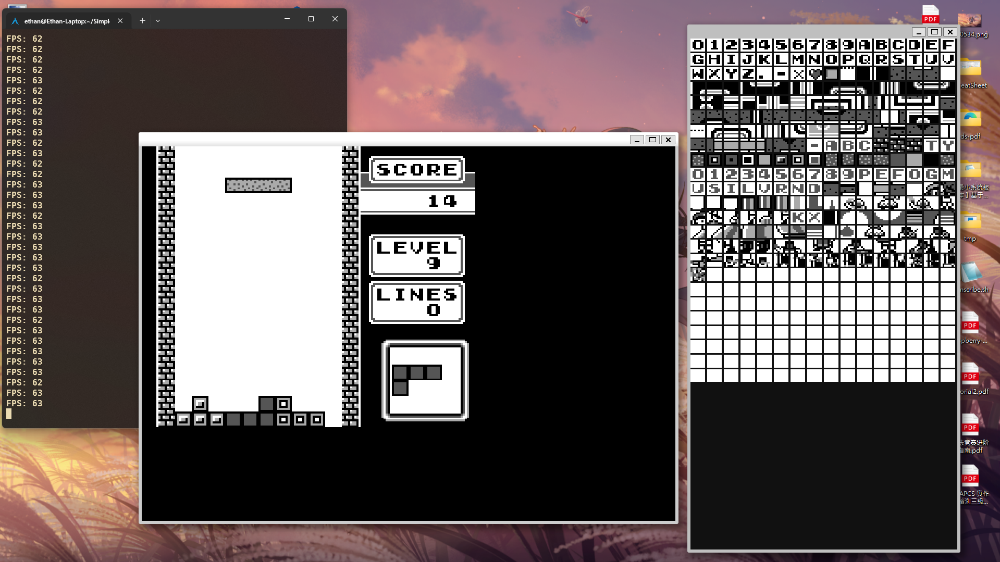

# Simple-GBEmu
A simple gameboy emulator using C and sdl, tested can run tetris and pass the blargg tests

## Features
- CPU emulation with cycle accuracy
- PPU pipeline with background and sprite rendering
- MBC1 mapper support
- Gamepad input via SDL
- Passes blargg test ROMs

## ScreenShot



## Build Instructions

### Unix (Linux/mac)

```bash
mkdir build && cd build
cmake ..
make
```

### Windows (MSYS2 + MinGW)
Currently use some unix dependiency (pthread...), so we need mingw for windows build

Requires dependencies:
```text
gcc, cmake, sdl2
```

## Usage
```bash
./gbemu path/to/rom.gb
```

## TODO
- Sound emulation
- Save states
- More mapper support (MBC2, MBC3, ...)